Guía de sistema de call center para agentes
===========================================

Ingreso y salida del sistema
----------------------------

1. Cargue la aplicación del teléfono y espere a que se registre.

2. Abra el navegador web (Google Chrome o Mozilla Firefox) e ingrese a la siguiente dirección: <https://call.netcomsatelital.com.ar/agent> .
   Lo recibirá la pantalla de ingreso.

  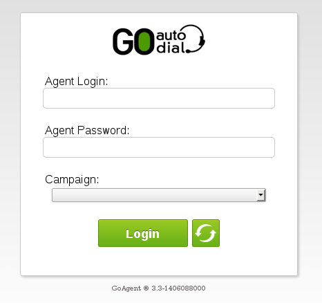

3. Ingrese su nombre de usuario (**Agent Login**) y contraseña (**Agent Password**).  Haga clic en el icono de las dos flechas giratorias (a la derecha del botón **Login**).  Despliegue la lista **Campaign** y seleccione la campaña en la que va a trabajar.

4. Presione el botón **Login**.

5. El sistema lo llamará al teléfono preconfigurado.  Atienda la llamada.  Si no escucha el mensaje de bienvenida, corte la llamada, cierre el softphone, cierre el navegador web y repita los pasos 1 a 4.  Del mismo modo, si no recibe la llamada telefónica pero se carga la pantalla principal de todos modos, presione el enlace **LOGOUT** en la parte superior derecha de la pantalla, cierre el softphone, cierre el navegador y repita los pasos 1 a 4.

6. Una vez dentro del sistema, el navegador mostrará la pantalla principal.

  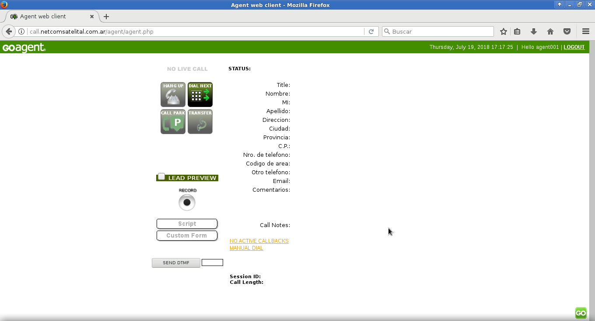

Cuando haya terminado su sesión de trabajo presione sobre el enlace **LOGOUT** en la parte superior derecha de la pantalla.

Hacer una llamada
-----------------

Para hacer un llamado presione el enlace **MANUAL DIAL** en la parte inferior de la pantalla.

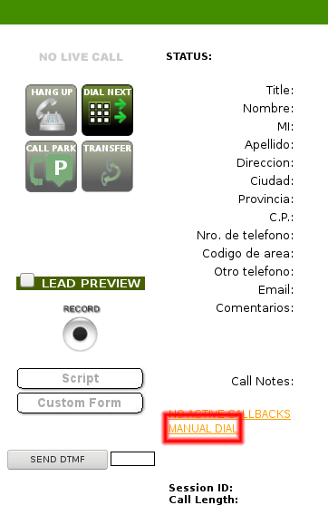

En la nueva pantalla complete los siguientes campos:
  - **Dial Code**: 54
  - **Pone Number**: el número telefónico con código de área, sin el cero, ni espacios, ni guiones. Por ejemplo, 1144445555 .

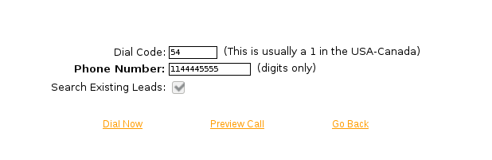

Presione el enlace **Dial now** para que el sistema comience el llamado telefónico.  Se pasará al formulario de datos de la persona.  **No** escuchará ningún tono mientras se establece la llamada.

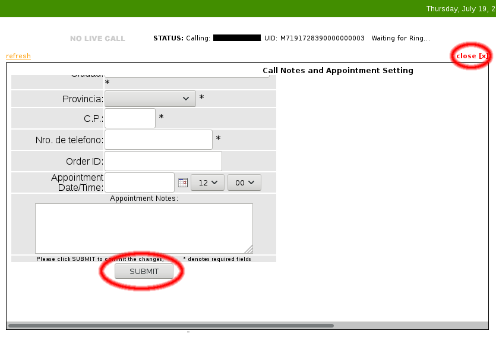

En este formulario se deben llenar los datos requeridos.  Una vez completados se debe presionar el botón **SUBMIT** de la parte inferior.  Dependiendo del tamaño de la pantalla, el formulario puede aparecer incompleto y quizá sea necesario desplazar la pantalla para ver el resto.  Luego de grabar los datos, el formulario volverá al principio y se mostrará la leyenda **Data Changes Accepted**.

Luego cerrar el formulario con el botón **close** (de color rojo, arriba a la derecha), y presionar el botón **HANG UP** para cortar la llamada y pasar al formulario de disposición.

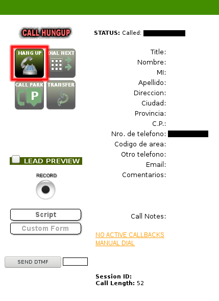

Estado de la llamada
--------------------

En todo momento se puede ver el estado de la llamada en la parte superior de la pantalla:

- **NO LIVE CALL** en gris: indica que *no* hay una conversación en curso.

- **LIVE CALL** en verde: indica que hay una llamada activa, se puede hablar con la otra persona.

- **CALL HUNGUP** en rojo: la otra persona colgó el teléfono.  Se debe presionar el botón **HANG UP** para colgar de este lado y pasar al formulario de disposición de llamada.

Problemas para establecer la comunicación
-----------------------------------------

En caso de que aparezca el siguiente error, presione el botón **OK**, luego el botón **HANG UP** para pasar al formulario de disposición de llamada, seleccione la opción **B** o **N**, y vuelva a intentar la llamada más tarde.  Si el problema persiste para varios números de teléfono diferentes contacte con el administrador del sistema.

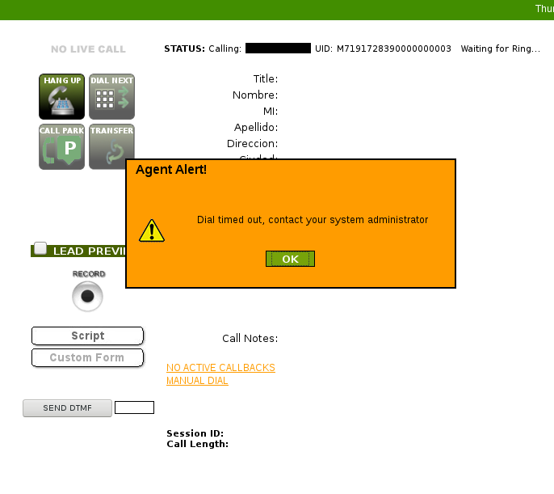

Disposición de la llamada
-------------------------

Luego de presionar el botón **HANG UP** aparecerá el formulario de disposición de llamada:

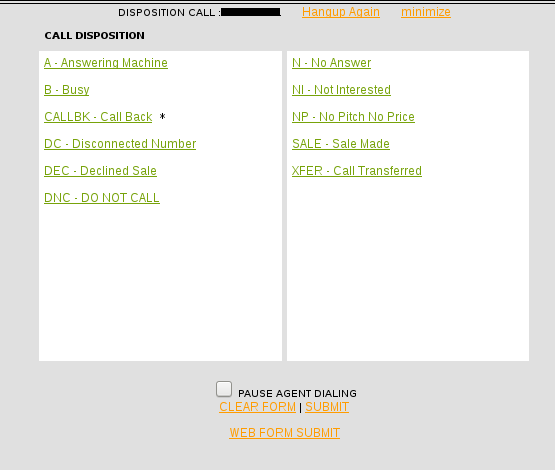

Seleccionar una opción según corresponda:

- **A**: Si atendió un contestador automático.
- **B**: Si dio ocupado.
- **CALLBK**: Para agendar la llamada para otro día y horario.
- **DC**: Si el número no corresponde a un abonado en servicio.
- **DNC**: Si el interlocutor solicitó que no vuelvan a llamarlo (listado *no llame*).
- **N**: Si no atendió nadie.

Luego de marcar la opción deseada, presionar el enlace **SUBMIT** de la parte inferior del formulario y se volverá a la pantalla principal.  En caso de que se haya seleccionado la opción **CALLBK** se irá a la pantalla de selección de fecha y hora para agendar el llamado.

Agendar llamada
---------------

Si se eligió la opción **CALLBK** en el formulario de disposición de llamada aparecerá una pantalla en donde se debe ingresar una nueva fecha y hora para el llamado.  Cuando llegue el momento indicado, el sistema le recordará al operador de turno que debe llamar a ese número.

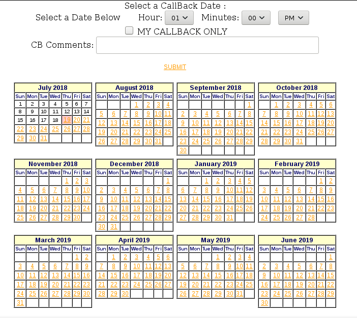

En la parte superior, seleccione una hora para el nuevo llamado (**Hour** y **Minutes**).  Marque la casilla **My Callback Only**. En **CB Comments** ingrese un recordatorio para el llamado (por ejempo, "*interesado en recibir más información pero sólo tiene tiempo para hablar después de las 19 hs.*"), y marque una fecha en el calendario de abajo.  Al finalizar presione el botón **SUBMIT** que está justo arriba del calendario, luego de lo cual volverá a la pantalla principal.

Retomar llamada agendada
------------------------

El estado de las llamadas agendadas se muesta en la parte inferior de la pantalla principal, justo encima del botón **MANUAL DIAL**, y puede mostrar los siguientes estados:

- **NO ACTIVE CALLBACKS**: No hay llamadas agendadas.
- **x ACTIVE CALLBACKS**: Hay llamadas agendadas a futuro.
- **x ACTIVE CALLBACKS / x CALLBACK ALERT FOR THIS DAY**: Ya es la fecha y hora para hacer algunas de las llamadas agendadas.

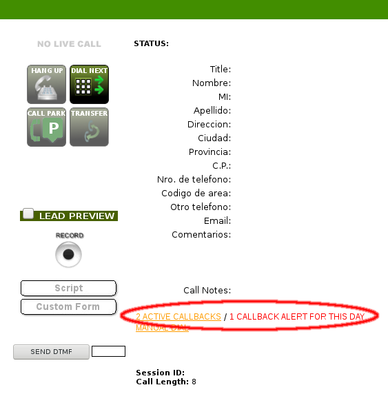

Para ver la lista de las llamadas agendadas presione sobre el enlace de **ACTIVE CALLBACKS**.  Se mostrará una pantalla con la lista de llamadas agendadas como esta:

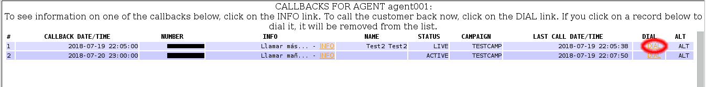

En la imagen se pueden ver dos llamadas agendadas.  La primera tiene en la columna **STATUS** el valor **LIVE**, lo que significa que ya se cumple con la fecha y hora solicitada para el llamado; la segunda tiene el valor **ACTIVE**, lo que significa que está agendada para una fecha y hora a futuro.

Para hacer el llamado presione sobre el enlace **DIAL** de la llamada elegida, y se pasará a la siguiente pantalla:

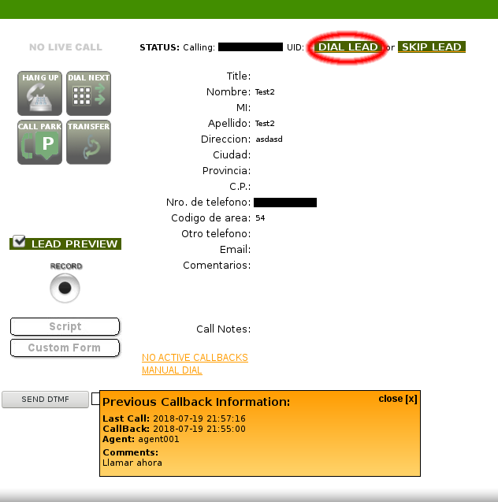

Se muestran los datos previamente cargados de la persona y el recordatorio agendado.  Para hacer la llamada presione el enlace **DIAL LEAD** en la parte superior y luego proceda de igual manera que con una llamada normal.
